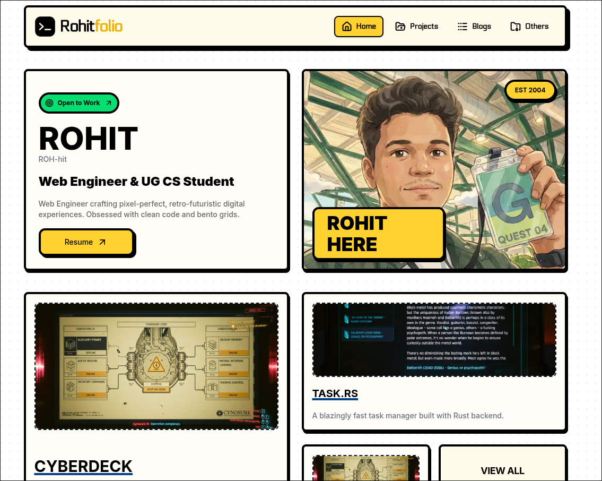
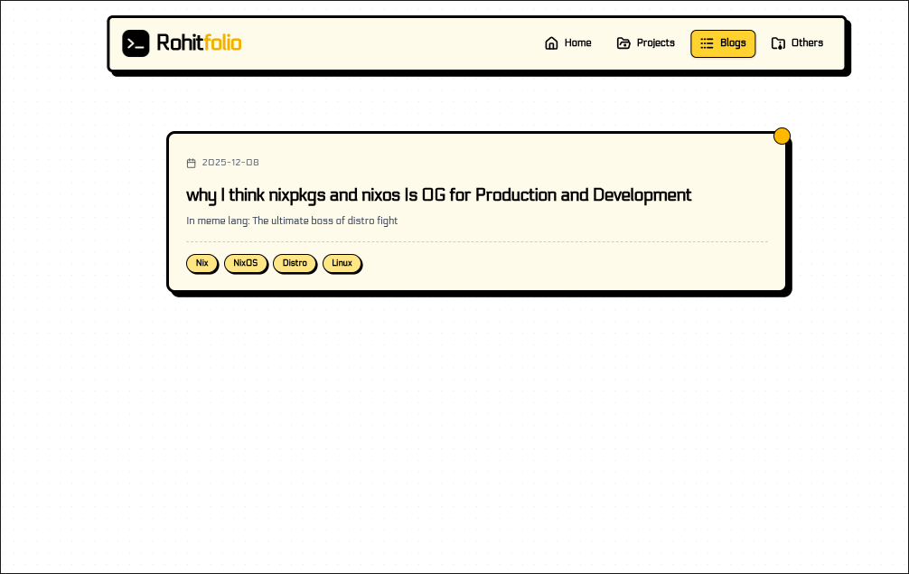
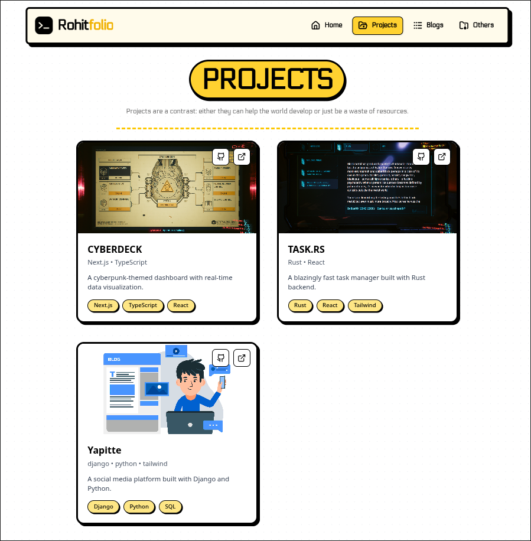
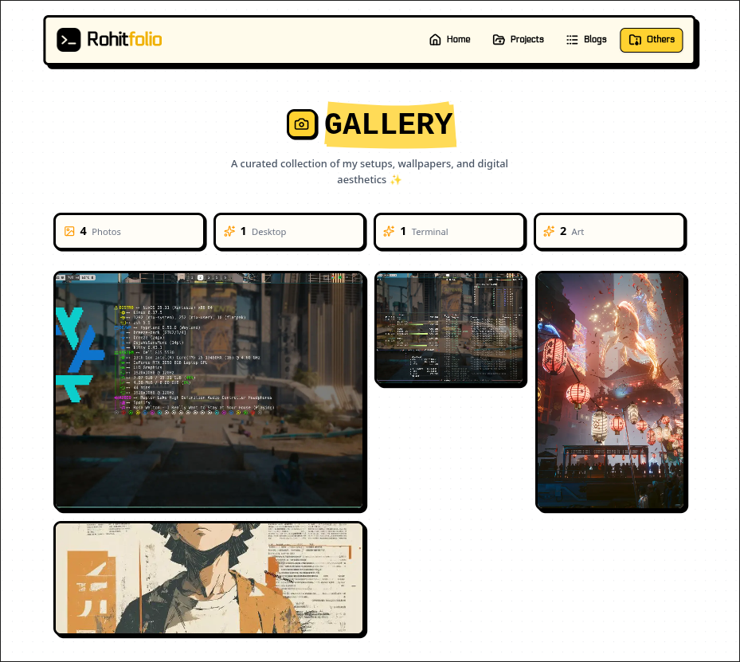

# Portfolio

A simple portfolio website built with Next.js, Tailwind CSS, TypeScript, React, a component library, and custom-made components.

## Gallery

## Features

- Built with Next.js for SSR and fast performance
- Styled using Tailwind CSS
- Written in TypeScript for type safety
- Utilizes a component library and custom components
- Responsive, clean gallery UI
- Currently hosted on vercel and you can view the live site [here](https://rohitvince.in/)

MIT License 
Copyright (c) 2025 Rohit-48

